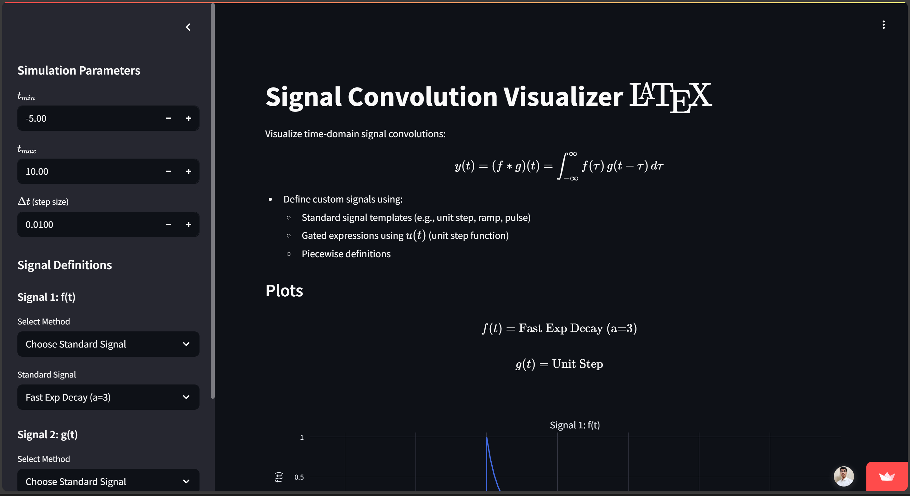
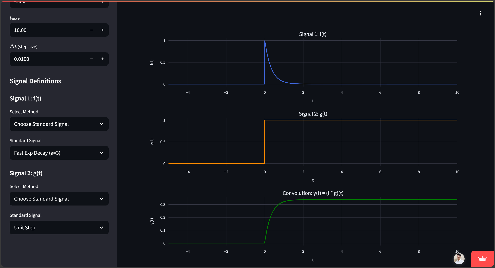

# Signal Convolution Visualizer

[](your-streamlit-app-url.streamlit.app)

An interactive web app built with Streamlit to help you visualize the convolution of two continuous-time signals.

  


---

## What It Does

- Lets you choose or define two signals: `f(t)` and `g(t)`
- Shows plots for `f(t)`, `g(t)`, and their convolution `y(t) = (f * g)(t)`
- Uses LaTeX-style math in plots for clarity

---

## Features

- **Signal Options:**
  - Pick from common signals: unit step, ramp, pulse, triangle, exponential, etc.
  - Or define your own using Python expressions (`t`, `u(t, shift)`, NumPy functions)
  - Supports piecewise signals with conditions on `t`

- **Convolution Logic:**
  - Uses `numpy.convolve` for standard cases
  - Handles special case `f(t) * u(t)` using numerical integration

- **Custom Time Settings:**
  - Set your own time range and resolution (`t_min`, `t_max`, `dt`)

---

## How to Run It Locally

1. Clone the repo:
   ```bash
   git clone https://github.com/adi776borate/convolution-app.git
   cd convolution-app
   ```
2.  **Create a Virtual Environment (Optional):**
    
```bash
    python -m venv venv
    # On Windows
    .\venv\Scripts\activate
    # On macOS/Linux
    source venv/bin/activate
```

3.  **Install Dependencies:**
    
```bash
    pip install -r requirements.txt
```

4.  **Run the Streamlit App:**
    
```bash
    streamlit run app.py
```

5.  Open your web browser and navigate to the http://localhost:8501.

